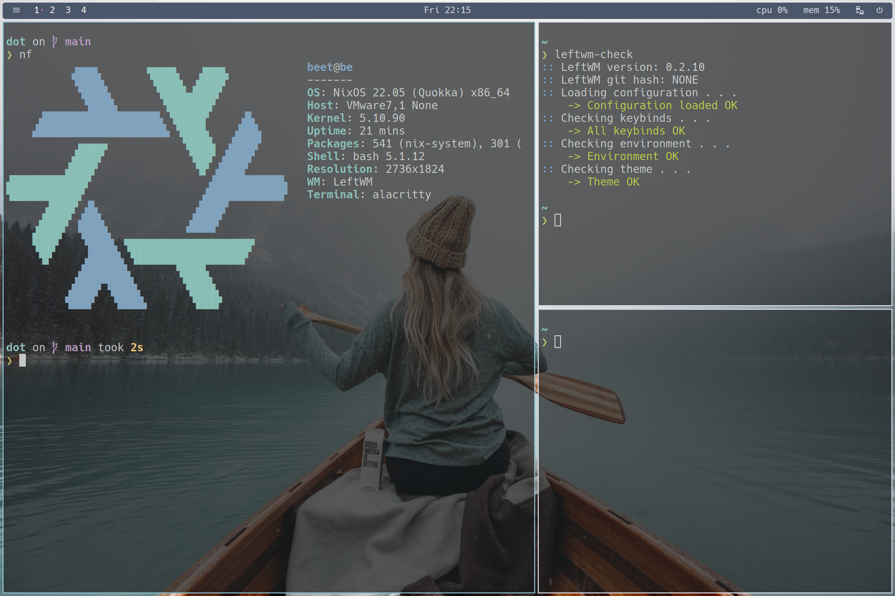

# My Reproducable Dev Environment using NixOS

## Local Environment Info

My daily development environment, running on VMware workstation Player, Windows 11 as host



> Background image source: https://unsplash.com/photos/5Lw1U5BIumE

## Install NixOS

- Without flakes

    1. Follow the [manual](https://nixos.org/manual/nixos/stable/index.html) installation guide

    2. Post installation

        a. enable vmware-tools

        ```nix
        virtualisation.vmware.guest.enable = true;
        ```
            
        b. [hiDPI settings](https://nixos.wiki/wiki/Xorg)
        
        c. [install nix flakes](https://nixos.wiki/wiki/Flakes)
        
        d. rebuild whole system with `sudo nixos-rebuild --flake "dot#be"`
        
        e. GUNPG | SSH
        
- With flakes
  
  Follow the [manual](https://nixos.org/manual/nixos/stable/index.html) installation guide, replace 2.3.5 command with the following
  
    ```nix
    # enter a shell env(with nix flakes installed)
    nix-shell -p nixFlakes git
    # clone dot repo using git
    git clone https://github.com/beetcb/dot.git /mnt/etc/nixos/dot
    # replace hardware configruation with newly generated one
    cp /mnt/etc/nixos/hardware-configuration.nix /mnt/etc/nixos/dot/sp-hardware.nix
    # finally, install nixos
    nixos-install --impure --flake /mnt/etc/nixos/dot#be
    ```

# Nix/NixOS/VM Gotchas

> Bellow is a list of gotchas I've encountered, record them as a reminder.

- [Installed sys lib not found by build tools?](https://nixos.wiki/wiki/FAQ/I_installed_a_library_but_my_compiler_is_not_finding_it._Why%3F)
- [Do port forwarding from localhost to vmhost](https://linuxize.com/post/how-to-setup-ssh-tunneling/)
- Defragmenting and shrinking VM disk

    1. [Disable 3D acceleration temporarily](https://communities.vmware.com/t5/VMware-Workstation-Pro/ISBRendererComm-Lost-connection-to-mksSandbox-and-MKS/td-p/2838888), weird bug on vmware workstation.
    2. [Defragmenting and shrinking on guest machine](https://superuser.com/a/1116213)
- OS management helper scripts
    ```bash
    home.shellAliases = {
      vmshare = "vmhgfs-fuse .host:/ /mnt/";
      os-rebuild = "sudo nixos-rebuild switch --flake ${os}#be";
      os-update = ''
        cd ${os} &&
        nix flake update &&
        os-rebuild
      '';
      os-cleanup = ''
        sudo rm -f /nix/var/nix/gcroots/auto/* &&
        nix-collect-garbage -d &&
        sudo nix-collect-garbage -d &&
        os-rebuild
      '';
    };
    ```
- Fix `node-gyp` build
    see [nixpkgs#javascript](https://github.com/NixOS/nixpkgs/blob/master/doc/languages-frameworks/javascript.section.md#javascript-tools-overview)

    ```bash
    npm i -g node2nix
    node2nix
    nix-shell -A shell
    npm i
    ```
# Channels
- For system pkgs: nixos latest statble channel
- For user pkgs: mixin of nixos latest unstatble & statble channel
